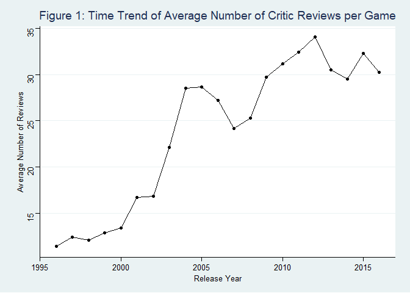
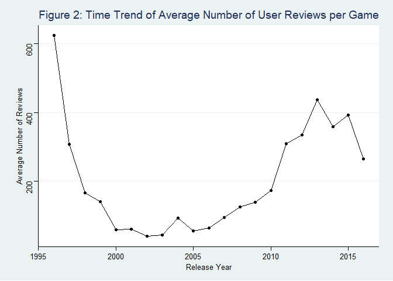
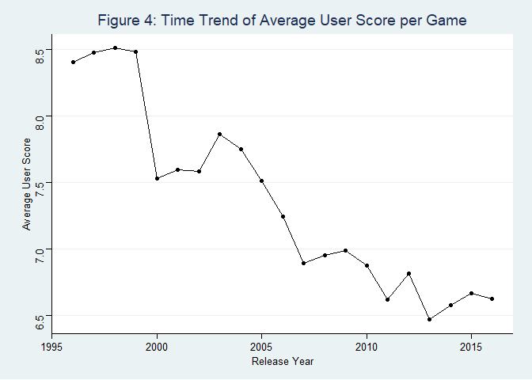

# Background and Data

Since the 1980s, video games have taken the world by storm and have offered fans a wide variety of escapes from the real world. They seek to impress consumers with breathtaking landscapes, memorable characters, and fun mechanics that transport people to alternate realities. In conjunction with this, the dawn of the modern internet in the 1980s allowed information and opinions to begin to spread rapidly, permitting people to access a wealth of information about seemingly every product imaginable. Video games are no different, as critics and fans alike upload their reviews online to sway players one way or the other. As an avid gamer myself, I often rely on these reviews to gauge if a new video game is worth buying. The average \$60 price tag on games provides a financial disincentive for me and many others to prematurely buy a game we might later regret. Because I have read many reviews for games I have purchased and avoided in my life, I wondered about the history of video game reviews, the effects they may have on sales, and if consumers like myself rely too much on them. Using a data set from data.world and conducting regression analysis using RStudio, I observed the time trends of video game reviews and analyzed the correlations between critic reviews, user reviews, and the global sales of thousands of game titles from 1996 to 2016.

 

Once I looked through the data set, I realized I needed to modify it to make my analysis easier to conduct. I started by filtering the data to only include observations from 1996 to 2016. This is because 1996 is the first year where multiple games were reviewed by both critics and users, and 2016 is the latest year in the data set. Years prior to 1996 had zero or only one game reviewed, so these outliers would have skewed the time trend results. Additionally, I converted the release year and user score columns to numeric data so I could graph them and include them in regressions to obtain meaningful results.

# Summary Statistics

The first portion of my analysis was looking at the summary statistics of the sales data. This data set includes global sales data and breaks that down further into regions, including North America, Europe, Japan, and other. I wanted to better understand the data and see what variations occurred across the different regions, if any.

 

<table style="text-align:center"><caption><strong>Table 1: Summary Statistics</strong></caption>
<tr><td colspan="6" style="border-bottom: 1px solid black"></td></tr><tr><td style="text-align:left">Statistic</td><td>N</td><td>Mean</td><td>St. Dev.</td><td>Min</td><td>Max</td></tr>
<tr><td colspan="6" style="border-bottom: 1px solid black"></td></tr><tr><td style="text-align:left">North American Sales</td><td>16,012</td><td>0.251</td><td>0.716</td><td>0.000</td><td>41.360</td></tr>
<tr><td style="text-align:left">Europe Sales</td><td>16,012</td><td>0.146</td><td>0.508</td><td>0.000</td><td>28.960</td></tr>
<tr><td style="text-align:left">Japan Sales</td><td>16,012</td><td>0.064</td><td>0.276</td><td>0.000</td><td>10.220</td></tr>
<tr><td style="text-align:left">Other Sales</td><td>16,012</td><td>0.048</td><td>0.190</td><td>0.000</td><td>10.570</td></tr>
<tr><td style="text-align:left">Global Sales</td><td>16,012</td><td>0.510</td><td>1.469</td><td>0.010</td><td>82.530</td></tr>
<tr><td colspan="6" style="border-bottom: 1px solid black"></td></tr></table>

 

Table 1 displays the summary statistics for the sales variables, and the two columns to note are the mean and max columns. The max column has much higher values than the mean column. The sales data are measured in millions of copies sold, and the max value for global sales is 82.53, meaning that a single very popular game (in this case, wii sports) sold 82.53 million copies worldwide. This is interesting when comparing to the mean column, which has much smaller values that are fractions of millions of copies sold. For example, the average global sales for a video game is 0.510, or about 510,000 copies sold worldwide. This key difference comes into play later in this blog when I run a regression to see the effects of video game reviews on video game sales, as the coefficients will appear to be small, but once we account for the fact that the unit on sales is millions of copies, the coefficients tell a more interesting story.

# Graphical Analysis

The next step in my analysis was to observe the time trends of the number of video game reviews and the scores of these reviews both from critics and users. Critic reviews can be important to consumers because they will often dig into the deep details of a game. Professional critics will discuss both the positive and negative aspects of a game and present their conclusions clearly. User reviews, on the other hand, are important as well because they can be more candid than critic reviews. Users are not typically paid for their review, and as a result will only share their opinions if they feel strongly one way or the other about a particular game. I first looked at the time trend of the average number of critic reviews for a single game to see how this has changed over the decades:

 

<!-- -->

 

Figure 1 illustrates a clear upward trend in the number of critic reviews per game over time. In the 1990s the average game received fewer than 15 reviews from professional critics, whereas not too long ago in 2016 games received a little over double that amount. Clearly it has become more popular to voice opinions about video games, which coincides with the vast amount of information consumers have ready at their fingertips. A slightly different trend is observed with user reviews, and with much greater magnitude:

 

<!-- -->

 

Figure 2 has a sharp decline in number of user reviews per game from 1996 to 2002. I was puzzled by this at first, but then thought that it could be the case that as video games grew in popularity and improved in production quality consumers were more interested in playing the games than writing reviews for them. In addition, it may have been difficult for users to leave reviews until the internet improved and made this easier for them. After 2003, the trend is similar to that in Figure 1 with a steady rise in the number of user reviews, although this is followed again by a decline after 2013. Clearly, users are less reliable at leaving reviews compared to critics, which ultimately makes sense because critics are paid to do it as their job while users do it solely for the benefit of the gaming community.

 

Beyond the time trends of the quantity of reviews, I was curious as to how the quality of reviews has changed over time as well. I created time trends of average review scores to look at these trends:

 

<!-- -->

 

Figure 3 illustrates how the average score per game has changed over time for critic reviews. Scores were high in the late 1990s, but sharply declined until 2008. This downward trend can be explained in part by the upward trend in critic reviews seen in Figure 1. As more critics wrote reviews, more opinions were shared, and it is possible that there was a greater divide in opinions as more critics joined the reviewing process. As a result, the average scores of video games declined. This logic, however, would not be able to explain the rise in critic scores after 2008, as even more critics were writing reviews during this time. Instead, we can turn our attention to the game developers, as it is likely that they increased game quality over this time span by improving graphics, story telling, and game mechanics.

 

Looking into user review quality, we observe a similar trend as we do for critics:

 

<!-- -->

 

Figure 4 demonstrates a steady decline in the average user score per review over time. There is no obvious correlation with Figure 2, so it is unclear why user scores declined after 1996. One possible explanation is that consumers are pickier than critics. Since they are not paid for their reviews and they have to pay for the game on top of that they might expect more out of the game than it delivers. As a result, it could be more likely that users are more often frustrated with games than critics, which could bring down the average user score for a game.

# Regression Analysis

Each of the time trends reveal something interesting about the history and trajectory of video game reviews. It was fascinating to see that they are more common today and that they have become more critical as well. While these graphs do indeed illustrate a compelling reality and allow me to better understand the video game review landscape, they do not alone answer the question I set out with. In order to observe the impact these reviews have on video game sales, I ran an ordinary least squares regression on the data. I regressed the five sales variables on each categorical variable in the data set as well as the number of reviews and scores for both critics and users. These categorical variables include data on the platform, publisher, release year, genre, developer, and ESRB rating of each game. I controlled for these because I wanted to eliminate any correlation between sales and these covariates so I could observe the sole effect reviews have on sales.

 

<table style="text-align:center"><caption><strong>Table 2: Regression of Video Game Sales on Critic and User Reviews</strong></caption>
<tr><td colspan="6" style="border-bottom: 1px solid black"></td></tr><tr><td style="text-align:left"></td><td>North American Sales</td><td>Europe Sales</td><td>Japan Sales</td><td>Other Sales</td><td>Global Sales</td></tr>
<tr><td style="text-align:left"></td><td>(1)</td><td>(2)</td><td>(3)</td><td>(4)</td><td>(5)</td></tr>
<tr><td colspan="6" style="border-bottom: 1px solid black"></td></tr><tr><td style="text-align:left">Number of Critic Reviews</td><td>0.008</td><td>0.005***</td><td>0.002***</td><td>0.002***</td><td>0.016***</td></tr>
<tr><td style="text-align:left"></td><td></td><td>(0.001)</td><td>(0.0003)</td><td>(0.0004)</td><td>(0.002)</td></tr>
<tr><td style="text-align:left"></td><td></td><td></td><td></td><td></td><td></td></tr>
<tr><td style="text-align:left">Critic Score</td><td>0.011</td><td>0.007***</td><td>0.001***</td><td>0.003***</td><td>0.022***</td></tr>
<tr><td style="text-align:left"></td><td></td><td>(0.001)</td><td>(0.0003)</td><td>(0.0003)</td><td>(0.002)</td></tr>
<tr><td style="text-align:left"></td><td></td><td></td><td></td><td></td><td></td></tr>
<tr><td style="text-align:left">Number of User Reviews</td><td>0.0002</td><td>0.0002***</td><td>0.00002***</td><td>0.0001***</td><td>0.001***</td></tr>
<tr><td style="text-align:left"></td><td></td><td>(0.00003)</td><td>(0.00001)</td><td>(0.00001)</td><td>(0.0001)</td></tr>
<tr><td style="text-align:left"></td><td></td><td></td><td></td><td></td><td></td></tr>
<tr><td style="text-align:left">User Score</td><td>-0.020</td><td>-0.014**</td><td>-0.0002</td><td>-0.006***</td><td>-0.041***</td></tr>
<tr><td style="text-align:left"></td><td></td><td>(0.006)</td><td>(0.002)</td><td>(0.002)</td><td>(0.015)</td></tr>
<tr><td style="text-align:left"></td><td></td><td></td><td></td><td></td><td></td></tr>
<tr><td style="text-align:left"><em>N</em></td><td>6,890</td><td>6,890</td><td>6,890</td><td>6,890</td><td>6,890</td></tr>
<tr><td style="text-align:left">R2</td><td>0.419</td><td>0.378</td><td>0.480</td><td>0.340</td><td>0.428</td></tr>
<tr><td colspan="6" style="border-bottom: 1px solid black"></td></tr><tr><td style="text-align:left"><em>Notes:</em></td><td colspan="5" style="text-align:left">***Significant at the 1 percent level.</td></tr>
<tr><td style="text-align:left"></td><td colspan="5" style="text-align:left">**Significant at the 5 percent level.</td></tr>
<tr><td style="text-align:left"></td><td colspan="5" style="text-align:left">*Significant at the 10 percent level.</td></tr>
<tr><td style="text-align:left"></td><td colspan="5" style="text-align:left">Regression was run with all other categorical covariates factored into each category. Only the variables of interest (critic count, critic score user count, and user score) are reported, and their coefficients can be interpreted as holding everything else in the data set fixed.</td></tr>
</table>

 

In the regression output in Table 2, I finally see the correlations between critic reviews, user reviews, and video game sales. The sales variables in the data set are measured in millions of copies sold, so the regression coefficients can be read as fractions of one million copies. Regression 5, showing the relationship between reviews on global video game sales, is the aggregation of each coefficient in the previous 4 regressions. Because of this, I will analyze regression 5 in depth to see the global effects of video game reviews and briefly discuss the other regressions to point out interesting regional variations.

# Results and Conclusions

In regression 5 there is a statistically significant correlation between reviews and video game sales. Interestingly, only three of the covariates have a positive effect. User score has a coefficient of -0.041, meaning that increasing a user score by about one tenth of a point (user scores range from 0 to 10 with differences in the tenths) on average is met with a decline in sales for a game of roughly 41,000 copies worldwide, all else equal. This negative relationship occurs in each region in the data set, so user reviews have a similar effect in all markets. This suggests that consumers distrust the opinions of their fellow gamers to the point where they react oppositely to the reviews. Consumers will, on average, buy more quantities of games that have lower average user scores and buy fewer copies of games with higher scores. In addition, the number of user reviews has little impact on video game sales, as adding another user review for a game is only correlated with an increase in global sales of about 1000 additional games, all else equal. This is not a substantive increase considering sales are tracked in the millions of copies sold, so clearly gamers do not put much weight on the opinions of other users when in the market for a new video game. Both of these occurrences could be explained by the fact that user reviews have become very critical over time, as illustrated in Figure 4, so consumers tend to ignore the critical user reviews when buying a new game.

 

Another interesting conclusion the table illustrates is that critic reviews are correlated with having a rather large impact on the success of a video game. The coefficient on number of critic reviews is 0.016, meaning that each additional review is met with an average increase in global sales of roughly 16,000 games. Additionally, the coefficient on critic score is 0.022, meaning that an increase of a critic score by one point (critic scores are measured from 0-100 in single digit increments) is correlated with an average increase in global sales of a game by roughly 22,000 copies all else equal. Considering that the mean global sales for a video game in the data set was about 510,000 copies sold, as seen in Table 1, being able to increase sales in increments of 16,000 and 22,000 copies on average is substantive. To exemplify this, one additional critic review could increase the sales of an average game by roughly 3% all else equal, so multiple reviews as well as high reviews would have a much greater impact on average. As a result, it is clear that gamers respect video game critics and value their opinions when deciding what new games to buy.

 

Finally, something that stood out to me was the fact that the coefficients on the number of critic reviews, critic score, and user score variables in regression 1 made up roughly half of the global effects observed in regression 5. This is fascinating to consider because it reveals that North Americans are more greatly impacted by video game reviews on average than gamers in other parts of the world. As an avid game researcher myself, I rely heavily on game reviews so that I know I am buying a quality game. With these regression results in hand, I can see that this is the case for the average North American gamer as well. In this region alone, an increase of a critic's score by one point is met with an average increase in game sales of about 11,000 copies, and an additional critic review is correlated to see an additional 8,000 copies to be sold in North America. When comparing these effects to the average number of copies of a game sold in North America, which is about 251,000 copies as shown in Table 1, I conclude that these were substantive effects as well. Increasing sales by 11,000 and 8,000 copies on average equates to an increase in sales of roughly 4% and 3%, respectively, which mirrors the global effects. As a result, the North American gaming market is the most responsive to others' opinions compared to the other regions, and as such contributes the greatest effect to video game sales from the reviews of those games.

 

At the end of this investigation, I was left with both surprising evidence and some that was complementary to my consumer beliefs. On the one hand, I firmly thought heading into this analysis that critic reviews of video games would have a positive impact on those games' sales. This was unsurprisingly corroborated by the regression, and follows my intuition of consumer theory almost exactly. I constantly seek out professional opinions to make sure that the games I am interested in deliver with a good story, cast of characters, and gameplay options. While I am certainly guilty of placing perhaps too much emphasis on critic reviews, it is still the case that they matter and provide important feedback so consumers can make more informed choices.

 

The other main takeaway from this is what surprised me the most. While I place more weight on critic reviews overall, I still enjoy reading what other gamers think about video games. The gaming community has its ups and downs, but overall it is a place where fans can come together and bond over their shared interests in video games. I have, up to this point, always considered user reviews as I felt like I could connect to them more closely than I could with critic reviews. Most of the time these reviews are brief, but they can have a candid aspect that critic reviews sometimes lack. The evidence in Table 2, however, informs me that I may be entertaining user opinions too much. As the data shows, the average user review and game score has a pretty significant negative relationship with game sales worldwide. Because of this, I, along with other gamers, should not take their opinions so seriously, and continue to seek out more of critic reviews. In hindsight this makes sense because it is ultimately a critic's job to provide their positive and negative thoughts of a game and dissect everything with a level of thoroughness that users typically do not have. While it can sometimes be beneficial to know what the average user thinks to find a different opinion and voice from a critic, the professionals are professionals for a reason, and gamers should respect their thoughts and strongly consider their reviews when looking for their next game to play.
