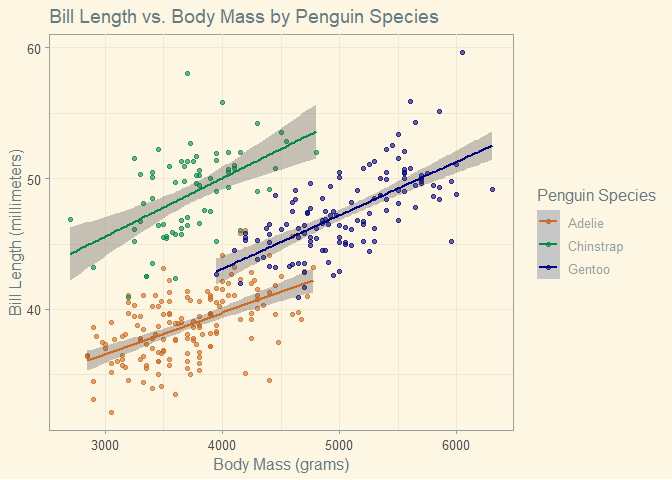
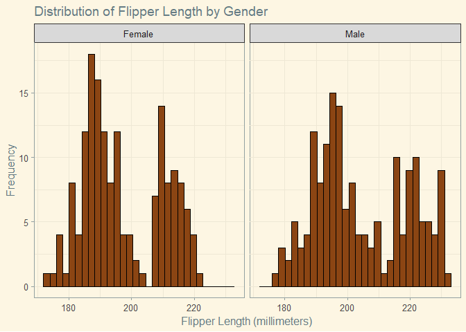
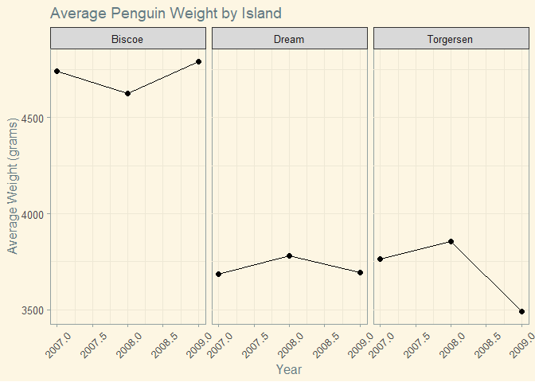

# What is the `PDF()` Function?

The `pdf()` function in R starts the graphics device driver for producing PDF graphics. In simpler terms, it is a funciton that allows us to export multiple graphs into a single PDF document. This is extremely helpful because we can export many graphs at once without having to use mutliple calls to the `ggsave()` function or the "export" button in the plots tab.

# Load in the data and packages

The `pdf()` function comes built in with R to use, so no other package is required. We will, however, need to load in data and the `ggplot2` package to create graphs with. We will also use the palmer penguins data from the `palmerpenguins` package. Finally, I will use the `tidyverse` package for dataframe manipulation and the `ggthemes` package to add a theme to my graphs.


```r
# load in packages
# already installed, but use this code if you do not have packages.
# install.packages("palmerpenguins)   
# install.packages("dplyr")
# install.packages("ggthemes")
library(ggplot2)
library(palmerpenguins)
library(tidyverse)
```

```
## ── Attaching packages ─────────────────────────────────────── tidyverse 1.3.2 ──
## ✔ tibble  3.1.8     ✔ dplyr   1.1.0
## ✔ tidyr   1.3.0     ✔ stringr 1.5.0
## ✔ readr   2.1.4     ✔ forcats 1.0.0
## ✔ purrr   1.0.1     
## ── Conflicts ────────────────────────────────────────── tidyverse_conflicts() ──
## ✖ dplyr::filter() masks stats::filter()
## ✖ dplyr::lag()    masks stats::lag()
```

```r
library(ggthemes)

pen <- penguins
```

# Create some graphs with the data

Before we can determine what graphs we can make with the data, it is important to look at the data from a broad perspective to see what variables we have at our disposal. I will use the `glimpse` function from the `dplyr` package to do so.


```r
# view data
glimpse(pen)
```

```
## Rows: 344
## Columns: 8
## $ species           <fct> Adelie, Adelie, Adelie, Adelie, Adelie, Adelie, Adel…
## $ island            <fct> Torgersen, Torgersen, Torgersen, Torgersen, Torgerse…
## $ bill_length_mm    <dbl> 39.1, 39.5, 40.3, NA, 36.7, 39.3, 38.9, 39.2, 34.1, …
## $ bill_depth_mm     <dbl> 18.7, 17.4, 18.0, NA, 19.3, 20.6, 17.8, 19.6, 18.1, …
## $ flipper_length_mm <int> 181, 186, 195, NA, 193, 190, 181, 195, 193, 190, 186…
## $ body_mass_g       <int> 3750, 3800, 3250, NA, 3450, 3650, 3625, 4675, 3475, …
## $ sex               <fct> male, female, female, NA, female, male, female, male…
## $ year              <int> 2007, 2007, 2007, 2007, 2007, 2007, 2007, 2007, 2007…
```

It looks like we have 3 factor variables, 2 double variables (which act as numeric variables) and 3 integer variables. For the first graph, I will create a scatter plot of `body_mass_g` and `bill_length_mm` with a line of best fit. To give the graph a better theme, I will use the `ggthemes` function from the `ggthemes` package.


```r
image_1 <- pen %>% 
  ggplot(aes(x=body_mass_g,y=bill_length_mm,color=species)) +
  geom_point(alpha = 0.6) +
  geom_smooth(formula=y~x,
              method="lm",
              fill = "gray26",
              alpha = 0.3) +
  labs(title = "Bill Length vs. Body Mass by Penguin Species",
       x = "Body Mass (grams)",
       y = "Bill Length (millimeters)",
       color = "Penguin Species") +
  theme_solarized() +
  scale_color_manual(values =c("Gentoo"="navy",
                               "Adelie"="chocolate",
                               "Chinstrap"="springgreen4"))
image_1
```

```
## Warning: Removed 2 rows containing non-finite values (`stat_smooth()`).
```

```
## Warning: Removed 2 rows containing missing values (`geom_point()`).
```

<!-- -->

The next graph will be a histogram of the distribution and frequency of `flipper_length_mm` faceted by sex.


```r
# create a vector for the new labesl for the faceted graphs (so we can capitalize "Female' and "Male")
labs = c("Female","Male")
# assign names to the labels so ggplot knows which capitalzed word is associated with which lowercase word.
names(labs)<-c("female","male")

image_2 <- pen %>% 
  # for this example, I will drop the NA values so that we only have two histograms, one for female and one for male.
  na.omit() %>% 
  ggplot(aes(x=flipper_length_mm)) +
  geom_histogram(fill = "chocolate4",
                 color = "black",
                 bins = 30) +
  facet_wrap(~sex,
             # use the labeller function to change labels of the faceted graphs using the label vector we made earlier.
             labeller = labeller(sex = labs)) +
  labs(title = "Distribution of Flipper Length by Gender",
       x = "Flipper Length (millimeters)",
       y = "Frequency") +
  theme_solarized()
image_2
```

<!-- -->

For my third and final graph, I will produce a time series depiction of the average penguin weight on each of the 3 islands in the data set. I will first use the dplyr package to group by island and year to calculate the mean weight, which I will then use in the ggplot call that follows:


```r
# use dplyr to group by year and island to caluclate avg weight, then graph using ggplot
image_3 <- pen %>% group_by(island,year) %>% 
  summarize(avg_weight = mean(body_mass_g,na.rm = T)) %>% 
  ggplot(aes(x=year,y=avg_weight)) +
  facet_wrap(~island) +
  geom_line() +
  geom_point(size = 2) +
  theme_solarized() +
  labs(title = "Average Penguin Weight by Island",
       x = "Year",
       y = "Average Weight (grams)") +
  theme(axis.text.x = element_text(angle = 45,
                                   vjust = 0.5))
```

```
## `summarise()` has grouped output by 'island'. You can override using the
## `.groups` argument.
```

```r
image_3
```

<!-- -->

# Use `pdf()` to save graphs to a single pdf file

Now that we have 3 graphs, it's time to use the `pdf()` function. To start the graphics device driver, we simply use the `pdf()` function like so:

1. First, we use the `pdf()` function to create an output file name to store the graphs (This is done using the `file =` argument to specify the file path and document title)
2. Next, we provide code for the graphs (or object names if we saved our graphs to objects, like we did in this tutorial)
3. Use the `dev.off()` function to turn off the graphics device driver, which then saves the pdf file to our computer


```r
pdf(file = "graph_compilation.pdf")
image_1
```

```
## Warning: Removed 2 rows containing non-finite values (`stat_smooth()`).
```

```
## Warning: Removed 2 rows containing missing values (`geom_point()`).
```

```r
image_2
image_3
dev.off()
```

```
## png 
##   2
```

After running the above code, I can navigate to where I saved my document (which is in my documents folder, in the r_help_docs and pdf_function sub-directories). I can click on the file and it will open up in my default internet browser where I can see the 3 graphs in a pdf file, and each graph is on its own page! Now we have a single file that contains all of our graphs that we can easily send to classmates, coworkers, and supervisors.
