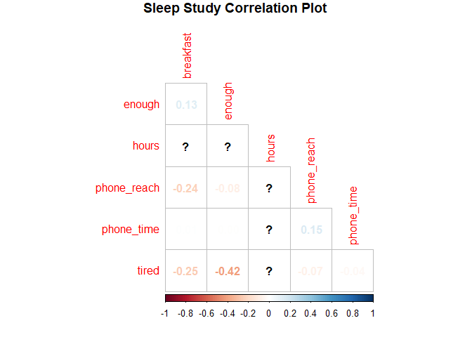

# Introduction

I found a data set from a sleep study posted on kaggle.com, and when I looked at the data I thought it would be a great opportunity to showcase a regression analysis. A description of the data is included below, and the data set and its description can be found [here](https://www.kaggle.com/datasets/mlomuscio/sleepstudypilot/).

## Packages


```r
library(pacman)
p_load(readr, dplyr, janitor, stargazer, corrplot)
```


# Data

## Description

Data collected from a survey-based study of the sleeping habits of individuals within the US. This data was conducted as a pilot study to determine whether or not students were satisfied with the survey.
Here is a description of each of the variables contained within the data set.
- Enough = Do you think that you get enough sleep?
- Hours = On average, how many hours of sleep do you get on a weeknight?
- PhoneReach = Do you sleep with your phone within arms reach?
- PhoneTime = Do you use your phone within 30 minutes of falling asleep?
- Tired = On a scale from 1 to 5, how tired are you throughout the day? (1 being not tired, 5 being very tired)
- Breakfast = Do you typically eat breakfast?

## Load in the data


```r
sleep_study <- read_csv("~/github_repos/projects-and-work-samples/sleep__study_regression_project/data/SleepStudyData.csv")
```

```
## Rows: 104 Columns: 6
## ── Column specification ────────────────────────────────────────────────────────
## Delimiter: ","
## chr (4): Enough, PhoneReach, PhoneTime, Breakfast
## dbl (2): Hours, Tired
## 
## ℹ Use `spec()` to retrieve the full column specification for this data.
## ℹ Specify the column types or set `show_col_types = FALSE` to quiet this message.
```

```r
View(sleep_study)
```

## Cleaning

### Column names

Looking at the data set, it's clear I will need to tidy it up first before being able to work with it. First, I will use the handy `clean_names()` function from the `janitor` package to make all variable names lower case and place underscores between words.


```r
sleep_study <- clean_names(sleep_study)
View(sleep_study)
```

### Re-code binary variabls

Next, I will re-code the variables `enough`, `phone_reach`, `phone_time`, and `breakfast` as binary variables. Binary variables are easier to work with in regressions because they are easier to interpret in the tables, and it is standard econometric practice. I will re-code these variables so that `yes` is `1` and `no` is `0`.


```r
sleep_study <- sleep_study %>% 
  mutate(enough = ifelse(enough == "Yes", 1, 0),
         phone_reach = ifelse(phone_reach == "Yes", 1, 0),
         phone_time = ifelse(phone_time == "Yes", 1, 0),
         breakfast = ifelse(breakfast == "Yes", 1, 0))

View(sleep_study)
```

Great! Now the categorical variables are all re-coded as binary, or 1s and 0s.

# Correlation plot

To begin any regression analysis, it helps to visualize the data to see if we can find any correlations between the variables. Since this data is from a survey and not from an experimental design, any relationships I find in the data are correlational, not causal. Despite this fact, it can still reveal interesting relationships that I could investigate further with an experiment to create causal claims.

I will create a correlation plot to observe relationships between all my variables. This is particularly useful with binary variables because  typical scatter plot would not reveal much of anything, given that most of the variables only have two possible values. A great tool for making such a plot is the `corrplot` package. First, I will use the `cor()` function to create a correlation matrix (correlational values between variables) and then I will plot this matrix using the `corrplot()` function.


```r
corr_matrix <- cor(sleep_study)

corrplot(corr_matrix, 
         method = 'number',
         diag = F,
         type = 'lower',
         order = 'alphabet',
         title = "Sleep Study Correlation Plot",
         mar = c(1,1,1,1))
```

<!-- -->

According to the above correlation plot, there are clearly no strong relationships in the data. Relationships range from -1 to 1, and the closer they are to 0 means there is little to no relationship present in the data. The question marks indicate that there is insufficient data to calculate a relationship between those variables, which makes sense as there are only 104 participants in this study.

There are three relationships to note in this data. The first two involve `breakfast`, and have negative correlation values with `phone_reach` and `tired`. These negative correlations indicate that sleeping within reach of your phone and claiming to feel more tired the following day reduce the odds of breakfast the next day. The third relationship is between `tired` and `enough`, signifying that participants who claim to be more tired during the day also have a reduced chance of feeling like they got enough sleep the previous night, which makes perfect sense.

# Regression analysis

Now that I have an idea of what to expect regarding the magnitude and direction of the variable relationships, I will run a regression to further quantify the variables' relationship with an outcome variable of my choosing. In this case, it seems appropriate to use the `enough` variable because I want to observe how the other variables, like `phone_reach`, `phone_time` and `breakfast` impact one's ability to get enough sleep. 

I will use the built-in `lm()` function to run my regression.

## Creating and storing the regression


```r
reg <- lm(enough ~ ., data = sleep_study)
```

The regression is saved to the object `reg`. in order to see the table, I will use the `stargazer()` function from the `stargazer` package.

## Creating regression output table


```r
stargazer(reg,
          type = 'html',
          title = "Sleep Study Regression",
          dep.var.labels = "Enough",
          covariate.labels = c("Hours of sleep",
                               "Phone within reach",
                               "Phone used within 30 mins of bedtime",
                               "Tired",
                               "Breakfast"))
```


<table style="text-align:center"><caption><strong>Sleep Study Regression</strong></caption>
<tr><td colspan="2" style="border-bottom: 1px solid black"></td></tr><tr><td style="text-align:left"></td><td><em>Dependent variable:</em></td></tr>
<tr><td></td><td colspan="1" style="border-bottom: 1px solid black"></td></tr>
<tr><td style="text-align:left"></td><td>Enough</td></tr>
<tr><td colspan="2" style="border-bottom: 1px solid black"></td></tr><tr><td style="text-align:left">Hours of sleep</td><td>0.111<sup>***</sup></td></tr>
<tr><td style="text-align:left"></td><td>(0.031)</td></tr>
<tr><td style="text-align:left"></td><td></td></tr>
<tr><td style="text-align:left">Phone within reach</td><td>-0.078</td></tr>
<tr><td style="text-align:left"></td><td>(0.095)</td></tr>
<tr><td style="text-align:left"></td><td></td></tr>
<tr><td style="text-align:left">Phone used within 30 mins of bedtime</td><td>-0.089</td></tr>
<tr><td style="text-align:left"></td><td>(0.109)</td></tr>
<tr><td style="text-align:left"></td><td></td></tr>
<tr><td style="text-align:left">Tired</td><td>-0.173<sup>***</sup></td></tr>
<tr><td style="text-align:left"></td><td>(0.043)</td></tr>
<tr><td style="text-align:left"></td><td></td></tr>
<tr><td style="text-align:left">Breakfast</td><td>-0.050</td></tr>
<tr><td style="text-align:left"></td><td>(0.091)</td></tr>
<tr><td style="text-align:left"></td><td></td></tr>
<tr><td style="text-align:left">Constant</td><td>0.300</td></tr>
<tr><td style="text-align:left"></td><td>(0.286)</td></tr>
<tr><td style="text-align:left"></td><td></td></tr>
<tr><td colspan="2" style="border-bottom: 1px solid black"></td></tr><tr><td style="text-align:left">Observations</td><td>102</td></tr>
<tr><td style="text-align:left">R<sup>2</sup></td><td>0.276</td></tr>
<tr><td style="text-align:left">Adjusted R<sup>2</sup></td><td>0.239</td></tr>
<tr><td style="text-align:left">Residual Std. Error</td><td>0.416 (df = 96)</td></tr>
<tr><td style="text-align:left">F Statistic</td><td>7.335<sup>***</sup> (df = 5; 96)</td></tr>
<tr><td colspan="2" style="border-bottom: 1px solid black"></td></tr><tr><td style="text-align:left"><em>Note:</em></td><td style="text-align:right"><sup>*</sup>p<0.1; <sup>**</sup>p<0.05; <sup>***</sup>p<0.01</td></tr>
</table>

## Table analysis and conclusions

